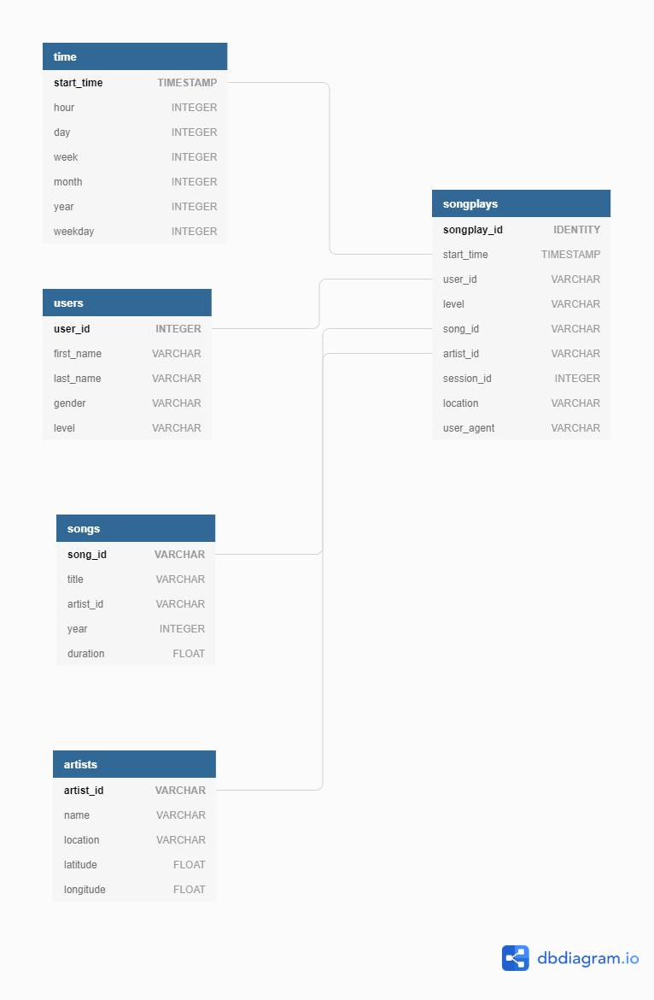

# P4 : Data Lakes

## Introduction
A music streaming startup, Sparkify, has grown their user base and song database even more and want to move their data warehouse to a data lake. Their data resides in S3, in a directory of JSON logs on user activity on the app, as well as a directory with JSON metadata on the songs in their app.

As their data engineer, you are tasked with building an ETL pipeline that extracts their data from S3, processes them using Spark, and loads the data back into S3 as a set of dimensional tables. This will allow their analytics team to continue finding insights in what songs their users are listening to.

## Project Description
In this project, you'll apply what you've learned on Spark and data lakes to build an ETL pipeline for a data lake hosted on S3. To complete the project, you will need to load data from S3, process the data into analytics tables using Spark, and load them back into S3. You'll deploy this Spark process on a cluster using AWS.
S3 --> ETL --> (Spark processing) --> EMR --> S3 (parquet)

## AWS S3 setup
Create S3 bucket for output
S3 Bucket : udacity-p4-datalakes

## To run
Execute in terminal "python etl.py"

### Local testing
Sample data for song and log data set for local test can be found in /data/test/.
Run "rm -rf udacity-p4-datalakes" to clear output folder after local testing.

## Sample data (Song Dataset)
Sample file paths:
song_data/A/B/C/TRABCEI128F424C983.json
song_data/A/A/B/TRAABJL12903CDCF1A.json

And below is an example of what a single song file, TRAABJL12903CDCF1A.json, looks like.
```json{"num_songs": 1, "artist_id": "ARJIE2Y1187B994AB7", "artist_latitude": null, "artist_longitude": null, "artist_location": "", "artist_name": "Line Renaud", "song_id": "SOUPIRU12A6D4FA1E1", "title": "Der Kleine Dompfaff", "duration": 152.92036, "year": 0}```


## Sample data (Log Dataset)
Sample file paths:
log_data/2018/11/2018-11-12-events.json
log_data/2018/11/2018-11-13-events.json

And below is an example of what the data in a log file, 2018-11-12-events.json, looks like.


## Schema
